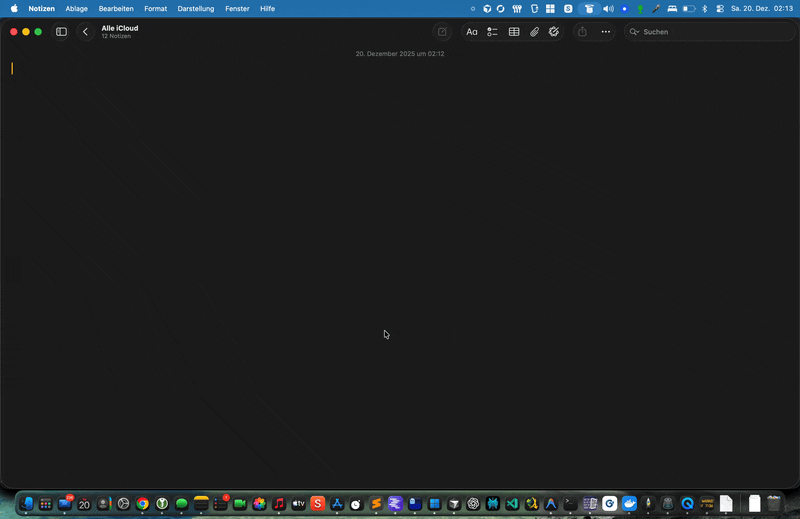

# PulseScribe

[](https://github.com/KLIEBHAN/pulsescribe/actions/workflows/test.yml)
[](https://codecov.io/gh/KLIEBHAN/pulsescribe)

[🇺🇸 English Version](README.md)

**Spracheingabe für macOS und Windows** – inspiriert von [Wispr Flow](https://wisprflow.ai).

Hotkey drücken, sprechen, loslassen – Text erscheint. Das war's.

<p align="center">
  
</p>

## Features

- **Echtzeit-Streaming** – ~300ms Latenz mit Deepgram
- **Mehrere Provider** – Deepgram, OpenAI, Groq oder lokales Whisper
- **LLM-Nachbearbeitung** – Transkriptionen bereinigen mit GPT/Llama
- **Kontext-Awareness** – Passt Stil an aktive App an (E-Mail, Chat, Code)
- **Visuelles Feedback** – Animiertes Overlay zeigt Aufnahmestatus

## Inhaltsverzeichnis

- [Installation](#installation)
- [Schnellstart](#schnellstart)
- [Hotkey-Konfiguration](#hotkey-konfiguration)
- [Provider-Auswahl](#provider-auswahl)
- [LLM-Nachbearbeitung](#llm-nachbearbeitung)
- [Bekannte Einschränkungen](#bekannte-einschränkungen)
- [Troubleshooting](#troubleshooting)
- [Dokumentation](#dokumentation)

---

## Installation

### macOS

```bash
# 1. Repository klonen
git clone https://github.com/KLIEBHAN/pulsescribe.git && cd pulsescribe

# 2. Dependencies installieren
brew install portaudio
pip install -r requirements.txt

# 3. Daemon starten
python pulsescribe_daemon.py
```

**Benötigte Berechtigungen:**
- **Mikrofon** – Systemeinstellungen → Datenschutz & Sicherheit → Mikrofon
- **Bedienungshilfen** – Für Auto-Paste (Cmd+V Simulation)
- **Eingabemonitoring** – Für Hold-to-Record Hotkeys

### Windows

```bash
# 1. Repository klonen
git clone https://github.com/KLIEBHAN/pulsescribe.git && cd pulsescribe

# 2. Virtuelle Umgebung erstellen (empfohlen)
python -m venv venv
venv\Scripts\activate

# 3. Dependencies installieren
pip install -r requirements.txt
pip install PySide6  # Optional: GPU-beschleunigtes Overlay

# 4. Daemon starten
python pulsescribe_windows.py
```

**Autostart:** `Win+R` drücken, `shell:startup` eingeben, Verknüpfung zu `start_daemon.bat` erstellen

### Fertige Installer

Download von [Releases](https://github.com/KLIEBHAN/pulsescribe/releases):
- **macOS:** `PulseScribe-{version}.dmg`
- **Windows:** `PulseScribe-Setup-{version}.exe`

---

## Schnellstart

### 1. API-Key besorgen

| Provider | Gratis-Kontingent | Key holen |
|----------|-------------------|-----------|
| **Deepgram** (empfohlen) | 200$ Guthaben | [console.deepgram.com](https://console.deepgram.com) |
| **Groq** | Kostenlos | [console.groq.com](https://console.groq.com) |
| **OpenAI** | Pay-as-you-go | [platform.openai.com](https://platform.openai.com/api-keys) |

### 2. Konfigurieren

```bash
# Beispiel-Config kopieren
cp .env.example ~/.pulsescribe/.env

# Mit deinem API-Key bearbeiten
nano ~/.pulsescribe/.env
```

Minimale `~/.pulsescribe/.env`:

```bash
DEEPGRAM_API_KEY=dein_key_hier
PULSESCRIBE_MODE=deepgram
```

### 3. Starten & Nutzen

```bash
# macOS
python pulsescribe_daemon.py

# Windows
python pulsescribe_windows.py
```

**Standard-Hotkeys:**
- **macOS:** `Fn` (Globe-Taste) halten → sprechen → loslassen
- **Windows:** `Ctrl+Win` halten → sprechen → loslassen

---

## Hotkey-Konfiguration

### Modi

| Modus | Verhalten | Geeignet für |
|-------|-----------|--------------|
| **Hold** (Standard) | Taste halten → sprechen → loslassen | Schnelle Diktate |
| **Toggle** | Drücken → sprechen → nochmal drücken | Längere Aufnahmen |

Beide Modi können gleichzeitig aktiv sein.

### Konfiguration

In `~/.pulsescribe/.env`:

```bash
# Hold-to-Record (Push-to-Talk)
PULSESCRIBE_HOLD_HOTKEY=fn          # macOS: Fn/Globe-Taste
PULSESCRIBE_HOLD_HOTKEY=ctrl+win    # Windows Standard

# Toggle (Drücken-Start, Drücken-Stop)
PULSESCRIBE_TOGGLE_HOTKEY=f19       # Empfohlen für macOS
PULSESCRIBE_TOGGLE_HOTKEY=ctrl+alt+r # Windows Standard
```

### Unterstützte Formate

| Format | Beispiele |
|--------|-----------|
| Funktionstasten | `f1`, `f12`, `f19` |
| Einzeltasten | `fn`, `capslock`, `space` |
| Kombinationen | `cmd+shift+r`, `ctrl+alt+space` |

### Visuelles Feedback

| Status | Farbe | Bedeutung |
|--------|-------|-----------|
| Listening | 🌸 Rosa | Hotkey gedrückt, wartet auf Sprache |
| Recording | 🔴 Rot | Sprache erkannt, Aufnahme läuft |
| Transcribing | 🟠 Orange | Text wird verarbeitet |
| Refining | 💜 Violett | LLM-Nachbearbeitung läuft |
| Done | ✅ Grün | Text eingefügt |
| Error | ❌ Rot | Fehler aufgetreten |

---

## Provider-Auswahl

| Provider | Latenz | Methode | Geeignet für |
|----------|--------|---------|--------------|
| **Deepgram** | ~300ms | WebSocket | Täglicher Gebrauch (empfohlen) |
| **Groq** | ~1s | REST | Gratis-Tier, schnell |
| **OpenAI** | ~2-3s | REST | Höchste Qualität |
| **Lokal** | variiert | Whisper | Offline, Datenschutz |

```bash
# In ~/.pulsescribe/.env
PULSESCRIBE_MODE=deepgram  # oder: openai, groq, local
```

### Lokaler Modus (Offline)

Für Offline-Transkription auf Apple Silicon:

```bash
pip install mlx-whisper

# In ~/.pulsescribe/.env
PULSESCRIBE_MODE=local
PULSESCRIBE_LOCAL_BACKEND=mlx
PULSESCRIBE_LOCAL_MODEL=turbo
```

Siehe [Lokale Backends](docs/LOKALE_BACKENDS.md) für alle Optionen.

---

## LLM-Nachbearbeitung

Aktiviere Refine um Transkriptionen zu bereinigen:

- Entfernt Füllwörter (ähm, also, quasi)
- Korrigiert Grammatik und Zeichensetzung
- Interpretiert Sprach-Commands ("neuer Absatz" → ¶)

```bash
# In ~/.pulsescribe/.env
PULSESCRIBE_REFINE=true
PULSESCRIBE_REFINE_PROVIDER=groq  # Gratis-Tier
```

### Kontext-Awareness

PulseScribe erkennt die aktive App und passt den Schreibstil an:

| Kontext | Apps | Stil |
|---------|------|------|
| `email` | Mail, Outlook | Formell, vollständige Sätze |
| `chat` | Slack, Discord | Locker, kurz |
| `code` | VS Code, Terminal | Technisch, Begriffe beibehalten |

### Sprach-Commands

Mit aktiviertem Refine funktionieren diese gesprochenen Befehle:

| Sprechen | Ergebnis |
|----------|----------|
| "neuer Absatz" | ¶ |
| "Komma" | `,` |
| "Fragezeichen" | `?` |

Siehe [Konfigurations-Referenz](docs/KONFIGURATION.md) für alle Refine-Optionen.

---

## Bekannte Einschränkungen

| Bereich | Einschränkung |
|---------|---------------|
| **Plattformen** | Linux noch nicht unterstützt |
| **LLM Refine** | Erfordert Netzwerk (kein lokales LLM) |
| **Custom Vocabulary** | Nicht von OpenAI API unterstützt |
| **Windows GPU** | Erfordert manuelle cuDNN-Installation |
| **Unsignierte Builds** | macOS: Bedienungshilfen nach jedem Rebuild neu autorisieren |

---

## Troubleshooting

| Problem | Lösung |
|---------|--------|
| Modul nicht gefunden | `pip install -r requirements.txt` |
| API-Key fehlt | `DEEPGRAM_API_KEY` in `~/.pulsescribe/.env` setzen |
| Mikrofon geht nicht | macOS: `brew install portaudio` |
| Keine Berechtigung | Mikrofon + Bedienungshilfen in Systemeinstellungen freigeben |
| Auto-Paste funktioniert nicht | App in Bedienungshilfen neu hinzufügen |

**Logs:** `~/.pulsescribe/logs/pulsescribe.log`

**Diagnostics:** Menübar → Export Diagnostics…

Weitere Lösungen unter [Detailliertes Troubleshooting](#detailliertes-troubleshooting) unten.

---

## Dokumentation

| Dokument | Beschreibung |
|----------|--------------|
| [Konfigurations-Referenz](docs/KONFIGURATION.md) | Alle Einstellungen und Umgebungsvariablen |
| [CLI-Referenz](docs/CLI_REFERENCE.md) | Kommandozeilen-Optionen für `transcribe.py` |
| [Lokale Backends](docs/LOKALE_BACKENDS.md) | Offline-Transkription einrichten |
| [Sicherheit & Datenschutz](docs/SICHERHEIT.md) | Datenverarbeitung und Berechtigungen |
| [Netzwerk-Anforderungen](docs/NETZWERK.md) | Endpunkte und Firewall-Regeln |
| [macOS Build](docs/BUILDING_MACOS.md) | App-Bundle und DMG-Erstellung |
| [Windows Build](docs/BUILDING_WINDOWS.md) | EXE und Installer-Erstellung |
| [Beitragen](CONTRIBUTING.md) | Entwicklungs-Setup und Richtlinien |
| [Architektur](CLAUDE.md) | Technische Referenz für Entwickler |

---

## CLI-Nutzung

Für Skripte und Automatisierung `transcribe.py` direkt verwenden:

```bash
# Datei transkribieren
python transcribe.py audio.mp3

# Vom Mikrofon aufnehmen
python transcribe.py --record --copy

# Mit LLM-Nachbearbeitung
python transcribe.py --record --refine --context email
```

Siehe [CLI-Referenz](docs/CLI_REFERENCE.md) für alle Optionen.

---

## Detailliertes Troubleshooting

### Auto-Paste funktioniert nicht (macOS App Bundle)

**Symptom:** Log zeigt `AXIsProcessTrusted = False` obwohl in Bedienungshilfen aktiviert.

**Ursache:** Unsignierte PyInstaller-Bundles ändern bei jedem Rebuild ihren Hash. macOS erkennt die "neue" App nicht.

**Lösung:**
1. Systemeinstellungen → Datenschutz & Sicherheit → Bedienungshilfen
2. PulseScribe entfernen (Minus-Button)
3. PulseScribe neu hinzufügen (Plus-Button oder Drag & Drop)

> Nach jedem Rebuild muss dieser Schritt wiederholt werden, bis die App signiert ist.

### Zwischenablage-Verhalten

Standardmäßig bleibt der transkribierte Text in der Zwischenablage nach dem Paste. Um die vorherige Zwischenablage wiederherzustellen:

```bash
# In ~/.pulsescribe/.env
PULSESCRIBE_CLIPBOARD_RESTORE=true
```

### Log-Dateien

```bash
# Haupt-Log
~/.pulsescribe/logs/pulsescribe.log

# Startup-Fehler
~/.pulsescribe/startup.log
```

### Häufige Probleme

| Problem | Lösung |
|---------|--------|
| pystray/pillow fehlt (Windows) | `pip install pystray pillow` |
| ffmpeg fehlt | `brew install ffmpeg` (macOS) oder `apt install ffmpeg` (Linux) |
| MLX Model 404 | `PULSESCRIBE_LOCAL_MODEL=large` oder volle Repo-ID verwenden |
| Transkription langsam | `deepgram` oder `groq` Modus nutzen, oder kleineres lokales Modell |
| Deepgram schneidet letztes Wort ab | Auf neueste Version updaten; Streaming leert Audio-Queue korrekt |

---

## Lizenz

MIT License – siehe [LICENSE](LICENSE) für Details.
